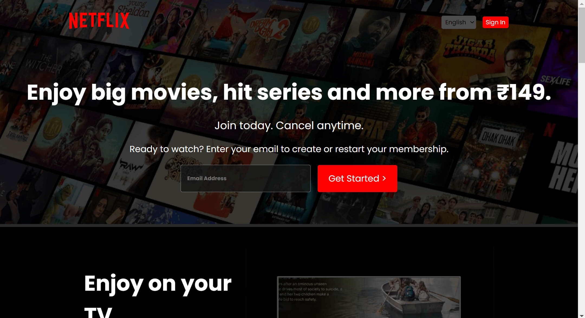
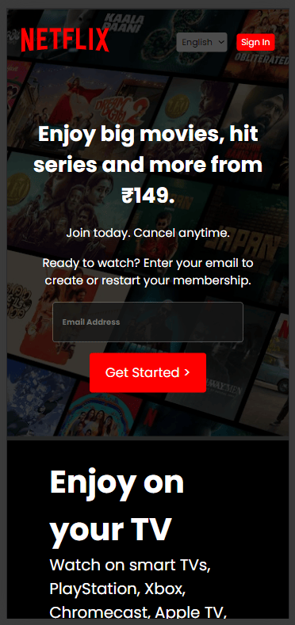

# Netflix Clone

This project is a responsive Netflix clone created using HTML and CSS. It aims to replicate the user interface of Netflix, allowing users to  view content in a visually similar manner.

## Features

- Responsive design: The clone is designed to adapt to various screen sizes, ensuring a seamless user experience across devices.
- Hover effects: Interactive hover effects provide a dynamic browsing experience, mimicking the behavior of the actual Netflix interface.

## Usage

To use the Netflix clone:

1. Clone or download the repository to your local machine.
2. Open the `index.html` file in your web browser.
3. Explore the various sections and content available on the clone.

## Screenshots

*Screenshot of the Netflix clone on desktop*

*Screenshot of the Netflix clone on mobile*

## Contributing

Contributions are welcome! If you have any suggestions for improvements or new features, feel free to submit a pull request. For any questions or inquiries, or if you have any comments on this project, please feel free to reach out to me at [here](mailto:aydeshmukh@outlook.com).

## Credits

This project was created by Ashwin.
